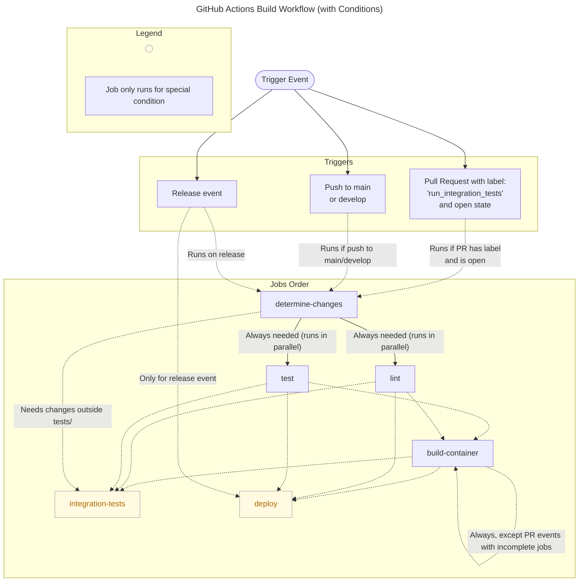

# Github Workflows

## ci.yml

This is our main CI/CD workflow

### Workflow Diagram

The following diagram shows the steps in our `ci.yml` github workflow.

### High Level Overview

This workflow will install Python dependencies, run the CI/CD with a single version of Python

For more information see: https://help.github.com/actions/language-and-framework-guides/using-python-with-github-actions

Only triggers the `lint`, `tests`, `build-container`, `determine-changes` and `integration-tests` jobs for the following conditions:

  - WHEN the PR has the github label `run_integration_tests` AND commits during when pull request is open 
  - WHEN it's a push into main or develop branches
  - WHEN it's a release event

#### integration-tests

 - In addition, the `integration-tests` job only runs when determine-changes job determines that there are non-unit tests changes

#### deploy

 - deploy job only runs when there is a release event

## automate_truststore.yml

This workflow will update the Genome nexus truststore file on a schedule and then run the mutation processing AND consortium release steps of the pipeline to make sure the pipeline is working with the new truststore.

The truststore used in our pipeline to run the genome nexus annotator on MAF data.

For more background on the truststore and troubleshooting, please see:
[Updating Genome Nexus Annotator and Dependencies](https://sagebionetworks.jira.com/wiki/spaces/APGD/pages/3016687662/Updating+Genome+Nexus+Annotator+and+Dependencies#Updating-the-trust-ssl-file)

## build_genome_nexus_annotator.yml

This workflow will update and build the Genome Nexus `annotator.jar` file from a
user inputted param: `commit_hash`. This `commit_hash` value comes from pulling from a specific commit in the [genome-nexus-annotation-pipeline](github.com/genome-nexus/genome-nexus-annotation-pipeline).

This workflow runs **on demand** [through triggering the workflow via Github Actions](https://github.com/Sage-Bionetworks/Genie/actions/workflows/build_genome_nexus_annotator.yml). 

After a successful build, it will run the mutation processing step of the pipeline to annotate the test data. The manual part will be checking the annotated test data after this to make sure the results are expected.

For more background on the `annotator.jar`, validating the annotated results after the build and troubleshooting, please see:
[Updating Genome Nexus Annotator and Dependencies](https://sagebionetworks.jira.com/wiki/spaces/APGD/pages/3016687662/Updating+Genome+Nexus+Annotator+and+Dependencies#Updating-the-annotator.jar)